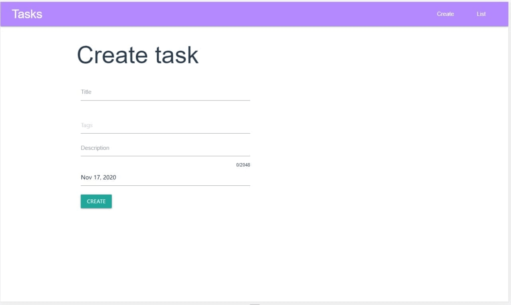
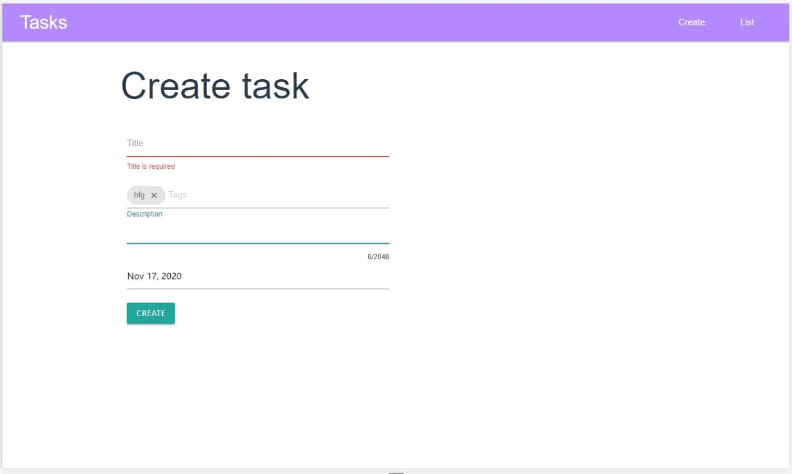
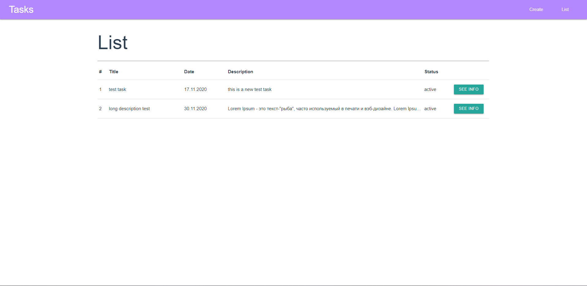

# task_tracer

## Используемые технологии
* Vue
* Vuex
* Vue Router
* Materialize.css
* LocalStorage

## Создание задачи


Присутствует валидация:
* поле Title обязательное к заполнению
* поле Description позволяет написать 2048 симбволов максимум
* поле Datepicker позволяет выставить дедлайн для задачи
* Данные сохраняются между сессиями



## Список задач



## Настройка проекта
```
npm install
```

### Запуск для разработки
```
npm run serve
```

### Запуск на продакшен
```
npm run build
```
